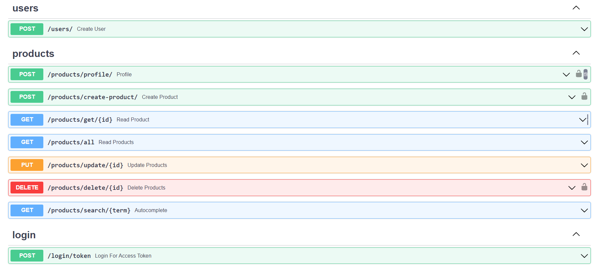

# 👨‍🌾FarmConnect
Connecting to farmers:

Revolutionizing agriculture support through unprecedented abstraction, user-friendly interfaces, and ubiquitous access.

## Problem Statement

Designing innovative Android applications to address societal challenges in the Indian context, particularly aligned with the United Nations' Sustainable Development Goals (SDGs), is a formidable yet rewarding endeavor. With India's vast population, cultural diversity, and multilingual landscape, the potential to create meaningful and impactful solutions is immense


## Features

1. A personalized Chat Bot
2. Provides best solutions to the farmer's problem algorithm.
3. Crop Recommendation
4. Fertilizer Recommendation
5. Disease Prediction
6. Weather Forecasting
7. Multilingual



- **Frontend**: Java
- **Backend**: 
- **IDE**: VS Code, Android Studio
- **Design**: Figma, Canva
- **API Testing & Documentation**: 
- **Version Control**: Git and GitHub

#### GitHub Repository Structure


| S.No. | Branch Name                                                                  | Purpose                       |
| ----- | ---------------------------------------------------------------------------- | ----------------------------- |
| 1.    | [frontend](https://github.com/rudrakshi99/Farmer-Call-Center/tree/master)      | contains all Frontend code    |
| 2.    | [backend](https://github.com/rudrakshi99/Farmer-Call-Center/tree/backend)    | contains all Backend code     |


## 🌾Deployment and Usage
### Deploying the API endpoints (backend)
- Backend is developed using FastAPI (python)
- Go to the backend folder 
```bash
  cd backend
```
- Install all the requirments
```bash
  pip install -r requirments.txt
```
- Run the server (default port: http://127.0.0.1:8000)
```bash
  uvicorn main:app
```
- Already hosted server could be found on 
```bash
  https://farmconnectback.onrender.com/docs
```

### Generating and Testing APK (frontend)
- Frontend is developed on Android studios
- Change the endpoint URL to your own backend URL.
- Use 10.0.2.2:8000 to access the localhost.
- Generate the .apk file from the Android Studios


## 🐄API Documentation
- The project provides API endpoints for the developers to implement them in their own projects, extensions or apps.
- API Documentation is simple and is available at http://127.0.0.1:8000/docs
- 


## Team Members:

| S.No. | Name | Role | GitHub Username:octocat: |
| --------------- | --------------- | --------------- | --------------- |
| 1. | Ansh Anand | Backend Development| [@HonestFreak](https://www.github.com/HonestFreak)  |
| 2. | Thota Rajeev | Frontend Development | [@rajeev210403](https://github.com/rajeev210403) |
| 3. | Karthik Prasad S | Backend Development | [@karthikprasads](https://github.com/karthikprasads) |
| 4. | Nithin Chepuri | Frontend Development| [@NithinChepuri](https://github.com/NithinChepuri) |
| 5. | Sai Vignesh | Frontend Development | [@SaiVignesh-K](https://github.com/SaiVignesh-K)  |


## License

The Project is Opensource. Feel free to use or modify the code.

[](https://choosealicense.com/licenses/mit/)

[](https://opensource.org/licenses/)

[](http://www.gnu.org/licenses/agpl-3.0)


