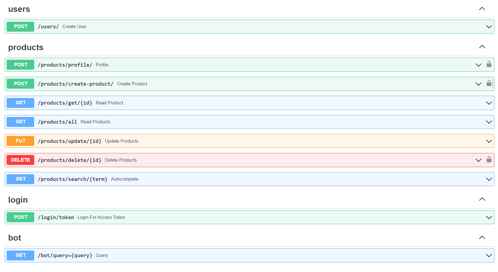

# 👨‍🌾 FarmConnect: Connecting Farmers with Innovation

Welcome to **FarmConnect**, where innovation meets agriculture in the heart of India! Our Android application is not just another farming assistant; it's a revolutionary solution designed to address societal challenges in the Indian context, aligned with the United Nations' Sustainable Development Goals (SDGs). With India's vast population, cultural diversity, and multilingual landscape, our app strives to create meaningful and impactful solutions for farmers.

## 🌱 Problem Statement

Designing innovative Android applications to support agriculture in India is both challenging and rewarding. With the country's vast population, diverse cultures, and multilingual environment, creating impactful solutions aligned with the Sustainable Development Goals (SDGs) is crucial.

## ✨ Key Features

- **Multilingual Support**: Our app understands and responds in popular regional languages, including Hinglish and regional languages written in Roman scripts.
- **Semantic Search**: Enjoy accurate search results by understanding the user's intent and contextual meaning of terms, ensuring relevant outcomes.
- **Vector Embeddings**: We employ advanced data representation techniques that carry semantic information for a better understanding of user queries.
- **Adaptability**: Easily update the app with new information, government schemes, techniques, etc., through various formats like PDF, text, or HTML.


## 🚀 Technologies Used

- **Frontend**: Java
- **Backend**: FastAPI (Python)
- **IDE**: VS Code, Android Studio
- **Design**: Figma, Canva
- **Version Control**: Git and GitHub
- 
#### GitHub Repository Structure


| S.No. | Branch Name                                                                  | Purpose                       |
| ----- | ---------------------------------------------------------------------------- | ----------------------------- |
| 1.    | [frontend](https://github.com/rudrakshi99/Farmer-Call-Center/tree/master)      | contains all Frontend code    |
| 2.    | [backend](https://github.com/rudrakshi99/Farmer-Call-Center/tree/backend)    | contains all Backend code     |


## 🌾Deployment and Usage
### Deploying the API endpoints (backend)
- Backend is developed using FastAPI (python)
- Go to the backend folder 
```bash
  cd backend
```
- Install all the requirments
```bash
  pip install -r requirments.txt
```
- Run the server (default port: http://127.0.0.1:8000)
```bash
  uvicorn main:app
```
- Already hosted server could be found on 
```bash
  https://farmconnectback.onrender.com/docs
```
- When hosting on server, you can use the Dockerfile provided to containerize the program to avoid any dependency issues.

### Generating and Testing APK (Frontend)
- Developed using Android Studio
- Update the endpoint URL to your backend URL.
- Use `10.0.2.2:8000` to access localhost.
- Generate the .apk file from Android Studio.


## 🐄API Documentation
- The project provides API endpoints for the developers to implement them in their own projects, extensions or apps.
- API Documentation is simple and is available at http://127.0.0.1:8000/docs
- 


## Team Members:

| S.No. | Name | Role | GitHub Username:octocat: |
| --------------- | --------------- | --------------- | --------------- |
| 1. | Ansh Anand | Backend Development| [@HonestFreak](https://www.github.com/HonestFreak)  |
| 2. | Thota Rajeev | Frontend Development | [@rajeev210403](https://github.com/rajeev210403) |
| 3. | Karthik Prasad S | Backend Development | [@karthikprasads](https://github.com/karthikprasads) |
| 4. | Nithin Chepuri | Frontend Development| [@NithinChepuri](https://github.com/NithinChepuri) |
| 5. | Sai Vignesh | Frontend Development | [@SaiVignesh-K](https://github.com/SaiVignesh-K)  |


## License

The Project is Opensource. Feel free to use or modify the code.

[](https://choosealicense.com/licenses/mit/)

[](https://opensource.org/licenses/)

[](http://www.gnu.org/licenses/agpl-3.0)


